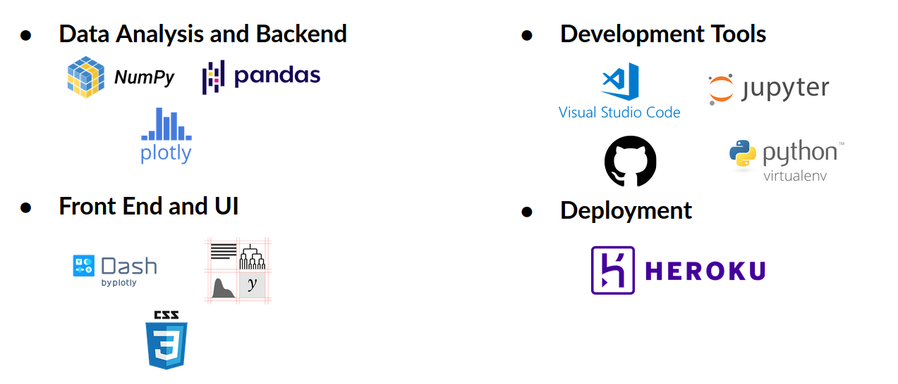
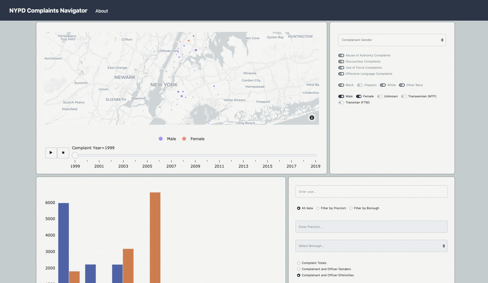
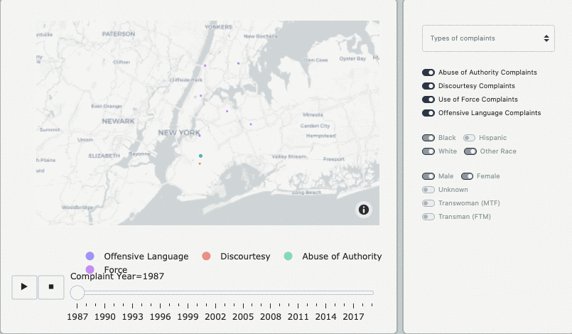
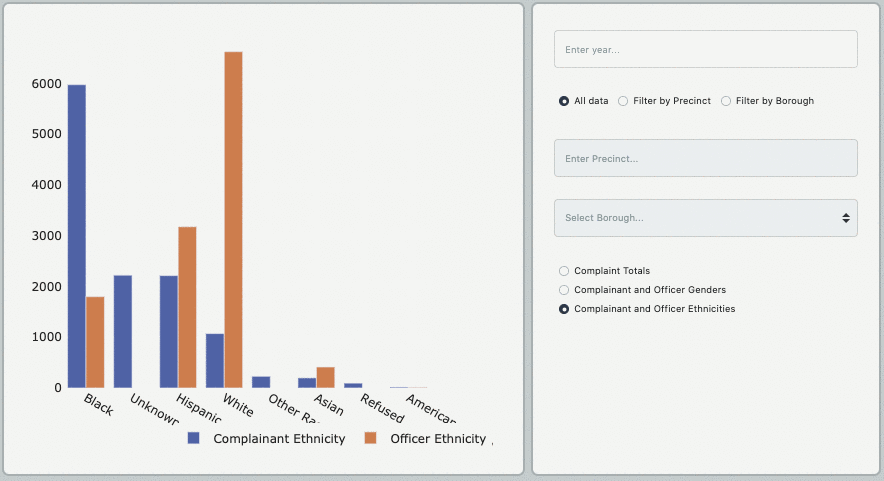

# NYPD Complaints Navigator

## Background

Due to an upsurge in advocacy against police misconduct and for transparency, in the summer of 2020 New York State repealed laws which had for years denied the public access to NYPD disciplinary records. The reform resulted in the release of a database featuring 12,000 civilian complaints of police misconduct, including tens of thousands of allegations. NYPD Complaint Navigator is a data visualization "dashboard" application, that enables users to filter and analyze this newly available data. This application is intended as a tool for community members, activists, and policy makers to facilitate the understanding and exploration of this data. We hope that this tool can be especially useful to communities impacted by police misconduct.

NYPD Complaint Navigator is a student project developed by Computer Science students at the City University of New York.

## About The Data

The data used in this application is downloaded from ProPublica's Data Store. The data features: - 12,000 unique complaints filed against 4,000 active duty officers, and over 30,000 distinct allegations. - Civilian complaints dating back to 1985. - Demographic information associated with each allegation, including complainant and officer ethnicity and gender, precincts associated with each complaint, and Civilian Review Board outcome.

These details are used to create the visualizations provided in the NYPD Complaitns Navigator. Users of the application can search for a specific officer and view a summary and visualizations based on data from allegation made against the given officer.

**More details about the data, including the original .csv file and relevant .xlsx files can be found in the `data` folder inside the root directory.**

## How We Built It

The NYPD Complaints Navigator was built using the Dash Web-App Framework. We used Pandas and Numpy for data wrangling and data analysis. We used the Plotly Graphing Library to generate interactive visualizations. We used Google Geolocation API to populate the dataframes with geographic coordinates and produce map visualizations. Finally we styled the app using the Dash Bootstrap Components library and CSS3 for further customization, and deployed it using Heroku.

## Try The Dashboard ([NYPD Complaints Navigator](https://nypdcomplaintsnavigator.herokuapp.com/))

